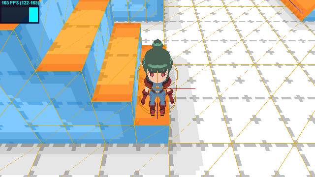
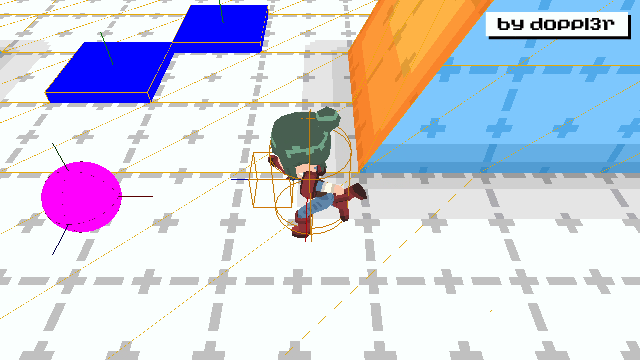

# Kinematic Character Controller Example
This example shows how to create a **Kinematic Character Controller** (aka "KCC") using Rapier.js and Three.js.

## Local Development

- Clone repo: `git clone https://github.com/doppl3r/kinematic-character-controller-example`
- Open project in VS Code
- Open Terminal: `View > Terminal`
- Install NodeJS package libraries: `npm install`
- Run development libraries `npm run dev`
- Use the link it provides. Ex: `http://localhost:5173`

## Key Classes
 - [EntityControllerKinematic.js](src/js/EntityControllerKinematic.js) - An input controller class for Kinematic Rigid Bodies. Can be used for players, conveyors, doors, etc.
 - [EntityFactory.js](src/js/EntityFactory.js) - A factory class that creates entities with vital components. Ex: 3D mesh, rigid bodies, colliders, etc.
 - [Entity.js](src/js/Entity.js) - The base class for all entities.
 - [Game.js](src/js/Game.js) - A singleton class for managing game states, loops, entities, and resources.

## Screenshot


## Features

- **Asset loader**: Dynamically load and cache 3D models, audio, images etc.
- **Entity factory**: Create entities that include rigid bodies, colliders and 3D models using JSON properties
- **Entity templates**: Predefined instructions for creating entities
- **Entity controller**: Provides user input and controls for entities
- **Collision event system**: Dispatch collision events between entities
- **Game rendering pipeline**: Renders and smoothly interpolates 3D entity meshes in sync with the world rigid body coordinates

## Other Features

### Interpolation

To improve visual performance, this example separates the `physics` engine and the `graphics` engine into 2 separate [Interval.js](src/js/Interval.js) loops. The `physics` engine loop runs at 60hz, while the `graphics` loop runs at the refresh rate of your monitor (ex: 240hz).

The `alpha` value (between 0.0 and 1.0) is calculated by adding the sum of time that has changed between these two loops. The alpha value is then applied to the 3D objects position/rotation each time the graphics loop is called.

Here is a `slow motion` example that demonstrates the interpolation between the physics engine and the graphical rendering. Without interpolation, the game would appear as choppy as the wireframes.



### Custom Events

The physics entity system is designed to dispatch events to observers by event type (ex: `collision`, `added`, `removed` etc). The following example shows how you can prescribe a `collider` event to a specific entity using object data (see [EntityTemplates.js](src/js/EntityTemplates.js)):
```
static teleport = {
  colliders: [
    {
      events: [
        {
          name: 'teleport',
          value: { x: 0, y: 0, z: 0 }
        }
      ],
      shapeDesc: {
        type: 'cuboid',
        arguments: [0.5, 0.5, 0.5]
      }
    }
  ]
}
```

This is where the logic of the "teleport" function exists (see [EntityEvents.js](src/js/EntityEvents.js)):
```
static teleport = event => {
  event.pair.setPosition(event.value);
}
```

## Vite

This example uses [Vite](https://vitejs.dev) for **hosting** a local environment and includes commands to **package** for web (similar to Webpack).

## Vue.js

[Vue.js](https://vuejs.org/) is used for the game UI, and leverages the latest **Composition API** introduced in version 3. This JavaScript framework is *"An approachable, performant and versatile framework for building web user interfaces"*.

**Vue Component**

 - [PageKinematic.vue](src/vue/PageKinematic.vue) - A simple Vue.js component you can modify.

## Assets
- All 3D models and textures were designed by doppl3r (Jacob DeBenedetto), and can be used on any project with proper credit.

## Additional Resources
- Rapier.rs [Character Controller](https://rapier.rs/docs/user_guides/javascript/character_controller) Documentation.

## Social Media
- Threads: https://www.threads.net/@doppl3r
- Website: https://www.dopplercreative.com